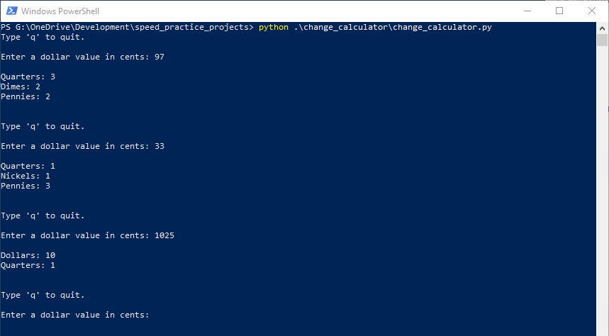

# Collection of Coding Speed Practice Projects
This repository holds a collection of small programs I developed in
order to drill rapid development. My goal for each project is to develop
a working program in a compressed timeframe (e.g. 30 minutes), then stop.
If there are any changes I would like to make, each individual project
will have its own README, and kneejerk refactorings I would like to do or
would have normally done will be detailed there.

I am undertaking these drills as my initial programming instinct is to
spend too long endlessly refactoring as I go to make everything optimal
first. This is useful when working on [larger projects](https://github.com/jtmorris/ad-blocking-detector);
however, it is detrimental when doing small one-off scripts or demonstrating
coding to others.

I am teaching myself how to program from the coding speed mindset, as a
supplement to the methodical, careful, continuous refactoring and optimizing
approach I naturally am inclined to use, that can be too slow and plodding.

## Notable Suboptimal Practices:
To bolster my development speed, I will consciously choose to make the
following choices, in opposition to my normal impulses. I consider these
choices generally suboptimal for robust, scalable, maintainable projects
of any significant complexity; however, they do radically increase
upfront coding time, and for smaller projects like those shown here, are
arguably counterproductive.

### Testing
I am a proponent of test-driven development based on past experiences
without using extensive testing. However, good testing requires
significant development time. Instead, I will seek to make testing easily
implementable in theoretical future incarnations, but will typically
not implement anything significant in these projects.

### Configuration
I will often be hard coding things I *really* do not like hard coding.
My initial instinct would be to implement command line parameters, a
config file, and/or full blown settings UI. Typically, those will not be
implemented. I will instead opt for variable flags defined somewhere
easily visible and accessible, for situations I refuse to hard code, and
hard coding will be done when not detrimental.

### Performance Optimization
When ease/speed of development and optimization conflict, I will opt for
ease of development, except in egregious circumstances. For example, if
using a Python generator expression or list comprehension would net a
performance boost, but would require slowing down to properly code, I
will just use loops. Typically, optimization will be a result of
architecture or simple on-the-fly inclusion. The size and scope of the
projects will not be a heavy load, so performance will rarely, if ever,
be a primary concern.

# Projects Breakdown
## Console Change Calculator
[Directory Link](https://github.com/jtmorris/speed_practice_projects/tree/master/change_calculator)
A simple tool for calculating the optimal assortment of coins when making
change.

	

