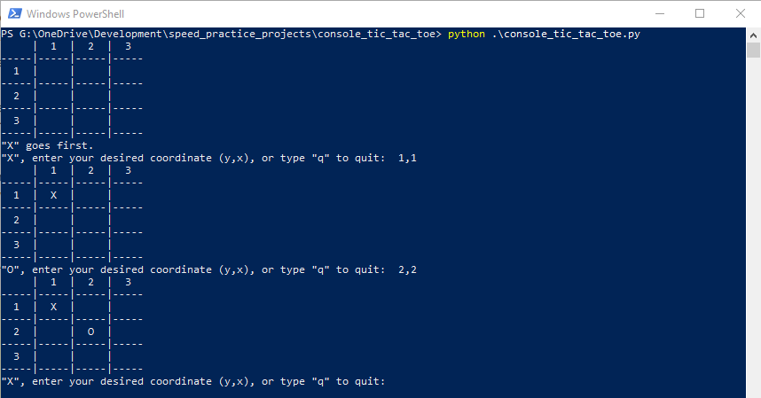

# Console Tic Tac Toe
This is a simple console version of the Tic Tac Toe game.

<p align="center">
	
</p>

## Requires
Python 3.5+
NumPy

## Usage
```
$ python console_tic_tac_toe.py
```

## Needed Improvements
### Variable Board Sizes
More interesting variants of Tic Tac Toe have larger boards. 4x4, 5x5,
and the like. It would be fairly simple to remove the hardcoded 3x3 board
and make it variable. However, as speed of implementation was my goal,
I opted for a fixed 3x3 to simplify testing and reduce code to write.